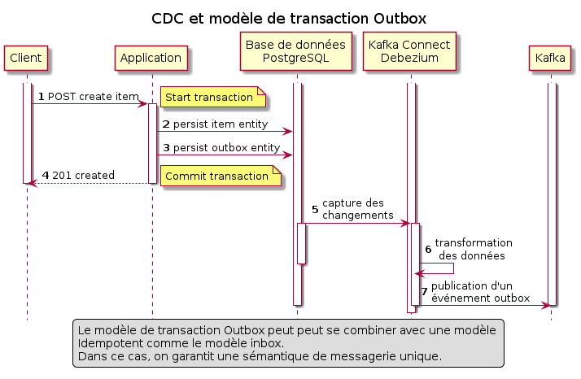
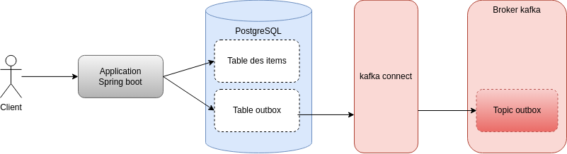

# CDC, Kafka, Outbox, Spring boot

## Introduction

Kafka Connect établit un flot de données entre une source et un topic Kafka. Le plus souvent:

- Des connecteurs du type *sources* établissent un flot depuis une base de données vers un topic Kafka.
- Des connecteurs du type *sink* établissent un flot depuis un topic kafka vers une base de données. données.

Cet example illustre le modèle de transaction outbox. Il comprend une application Spring Boot et un connecteur Kafka distribué librement par la société Debezium.
Le connecteur Kafka Connect réalise du Change Data Capture (CDC) dans les tables d'une base PostGreSQL. Les enregistrements capturés sont ensuite publiés sous la forme d'événements vers des topics Kafka.

## Kafka Connect

Kafka Connect est une API pour établir un flot entre un source de données et kafka à l'aide de connecteurs. Kafka connect s'exécute sous frome de processus indépendants des brokers et découplés de toute application. Kafka Connect est s'appuie sur les API Kafka Consumer et Producer. Kafka Connect fournit également un mécanisme de transformation des données dans un flot.

## Debezium

Alors que Kafka Connect fournit un environnement d'exécution pour  des connecteurs, Debezium fournit l'implémentation de connecteurs open source pour la capture des données modifiées (CDC). CDC fait référence à la capture de toutes les modifications apportées à une base de données, qu'il s'agisse d'insertions, de mises à jour ou de suppressions, en analysant les fichiers journaux des transactions de la base de données et en écrivant ces modifications en tant que nouveaux événements dans Kafka. Il est très efficace et fonctionne en temps réel. L'approche CDC est conforme au modèle ETL qui enchaine les étapes extraction, transformation et chargement. Debezium extrait les données de la base de données, les transforme selon une configuration qui peut être difinie via une API,et les charge dans Kafka.

## Boîte d'envoi transactionnelle

Le modèle Transactional Outbox garantit que les enregistrements écrits dans une table de boîte d'envoi sont écrits dans la même transaction que les écritures métiers correspondantes. Comme ces deux écritures sont atomiques, soit elles réussissent ensemble, soit elles sont rejettées ensemble. Ce modèle garantit la cohérence entre l'écriture de données métiers en base et l'écriture des événements associés dans un topic Kafka.

## Aperçu



L'application expose un point de terminaison RESTful. Les clients utilisent cette API pour demander la création d'un nouvel élément. 
L'élément est créé en base dans la même transaction que l'enregistrement associé dans la boîte d'envoi.



## Configurer le connecteur

Debezium fournit un connecteur Kafka Connect pour Postgres.
Les propriétés de ce connecteur sont décrites dans le fichier *debezium-postgres-source-connector.json* localisé dans répertoire *connecteur* à la racine du projet: Il existe de nombreuses options pour configurer un connecteur, consultez la documentation Debezium pour cela. 
Ce connecteur établit un flot qui diffuse les données modifiées dans la table *outbox*.

``` json
{
    "name": "debezium-postgres-source-connector",
    "config": {
        "connector.class": "io.debezium.connector.postgresql.PostgresConnector",
        "tasks.max": "1",
        "database.hostname": "postgres",
        "database.port": "5432",
        "database.user": "postgres",
        "database.password": "postgres",
        "database.dbname" : "postgres",
        "table.include.list": "debezium_postgres_demo.outbox",
        "transforms": "outbox",
        "transforms.outbox.type": "io.debezium.transforms.outbox.EventRouter",
        "transforms.outbox.route.by.field": "destination",
        "transforms.outbox.table.field.event.key": "id",
        "transforms.outbox.table.field.event.payload": "payload",
        "topic.prefix": "demo"
    }
}
```

## Mise en Oeuvre

LA démonstration comporte les étapes suivantes:

- Démarrer des conteneurs Docker (Kafka, Zookeeper, Postgres, Debezium) via docker-compose.
- Soumettre la définition du connecteur Kafka Connect via curl.
- Démarrer l'application de démonstration Spring Boot.
- Démarrer un consommateur kafka dans une console pour écouter le topic de la boîte d'envoi (rempli par Debezium).
- Soumettre une requête REST à l'application pour créer un nouvel élément.
- L'application crée l'élément, puis écrit dans la table de boîte d'envoi (au sein d'une me transaction).
- Debezium écrit un événement dans le topic sortant via Change Data Capture (CDC).
- Le consommateur kafka en exécution dans une console va afficher cet événement.

### Pré-requis

Git, Maven et Java 17.

### Installation des codes sources

Cloner le projet git et fabriquer les paquets.

```bash
git clone https://github.com/chvois1/kafka-outbox.git
```

### Démarrage de container dockers

``` bash
docker-compose up -d
```

## Vérifier que Kafka Connect est en exécution

``` bash
curl localhost:8083
```

``` json
{"version":"3.4.0","commit":"2e1947d240607d53","kafka_cluster_id":"todaSUJ3TYWOOHB2O0rRcQ"}
```

## Liste des connecteurs enregistrés

Le contenu intial du tableau des connecteurs Debezium enregistrés doit être vide

``` bash
curl localhost:8083/connectors
```

``` json
[]
```

## Enregistrer un nouveau connecteur

``` bash
curl -X POST localhost:8083/connectors -H "Content-Type: application/json" -d @./connector/debezium-postgres-source-connector.json
```

``` json
{}"name":"debezium-postgres-source-connector","config":{"connector.class":"io.debezium.connector.postgresql.PostgresConnector","tasks.max":"1","database.hostname":"postgres","database.port":"5432","database.user":"postgres","database.password":"postgres","database.dbname":"postgres","table.include.list":"debezium_postgres_demo.outbox","transforms":"outbox","transforms.outbox.type":"io.debezium.transforms.outbox.EventRouter","transforms.outbox.route.by.field":"destination","transforms.outbox.table.field.event.key":"id","transforms.outbox.table.field.event.payload":"payload","topic.prefix":"demo","name":"debezium-postgres-source-connector"},"tasks":[],"type":"source"}
```

## Lister le connecteur enregistré

``` bash
curl localhost:8083/connectors
```

``` json
["debezium-postgres-source-connector"]
```

### Construction de l'application

``` bash
mvn clean install
```

### Démarrage de l'application

``` bash
java -jar target/kafka-connect-debezium-postgres-demo-1.0.0.jar
```

### Démarrage du consommateur kafa

Dans une seconde fenêtre de terminal, ouvrir une session dans le container kafka

``` bash
docker exec -ti kafka bash
```

Lancer le consommateur kafka  qui se met à l'écoute des événements outbox

``` bash
kafka-console-consumer --topic outbox.event.item --bootstrap-server kafka:29092
```

Dans une troisième fenêtre de terminal, utilisez curl pour soumettre une requête Restful de type POST à l'application afin de créer un élément.

``` bash
curl -i -X POST localhost:9001/v1/item -H "Content-Type: application/json" -d '{"name": "test-item"}'
```

### Résultat

L'API RESTful de l'application doit retourner un code 201 et afficher les caractéristiques de l'élémént créé.

``` bash
TTP/1.1 201 
Location: fb830d20-abd7-468e-8b57-6828299f4c1d
Content-Length: 0
Date: Thu, 30 May 2024 16:43:12 GMT
```

En parallèle, l'application doit afficher dans ses traces la création de l'élémént ainsi que l'écriture dans la table outbox .

``` bash
18:43:12.143 INFO  d.s.ItemService - Item created with id fb830d20-abd7-468e-8b57-6828299f4c1d - and Outbox entity created with Id: c3a2c091-695c-4803-8388-cca06aa3f4b2
```

Enfin, le consommateur kafka doit afficher dans ses traces la réception de l'événements associé aux actions précédentes.

``` bash
"schema":{"type":"string","optional":true},"payload":"{\"id\":\"fb830d20-abd7-468e-8b57-6828299f4c1d\",\"name\":\"test-item\"}"}
```

### Arrêt

Suppression des connecteurs enregistrés:

``` bash
curl -i -X DELETE localhost:8083/connectors/debezium-postgres-source-connector
```

Arrêt des container:

``` bash
docker-compose down
```

### Nettoyage complet des images Docker

``` bash
docker rm -f $(docker ps -aq)
```

``` bash
docker system prune -a
docker volume prune
```
